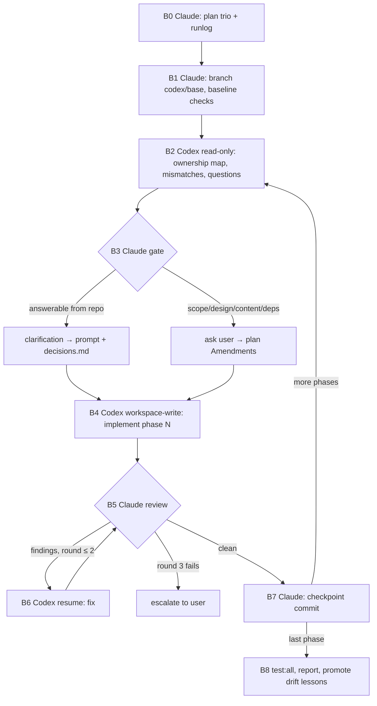

# Codex execution workflow — architecture

Companion to `codex-execution-workflow-2026-09-17-0655-plan.md` (steps) and `-decisions.md` (why). This file is the structural picture: who does what, which files carry state between the agents, and the exact contracts at each handoff. The plan refers to its sections by number.

---

## 1. Roles and trust boundaries

| | Claude (Opus) | Codex (`gpt-5.6-sol`, high) | User |
|---|---|---|---|
| Writes | plan trio, runlog, prompts, checkpoint commits | implementation files within each step's allowlist | — |
| Reads | everything | everything (`read-only` / `workspace-write` sandbox) | runlog, escalations |
| Runs | build, unit, integrity, **E2E (chromium + webkit)**, browser preview, `check-scope.sh` | build, unit, integrity (no E2E, since the sandbox can't bind ports) | `sudo` (Xcode licence) |
| Git | branch, diff, commit on `codex/*` | **none** | merge, push, PR |
| Decides | clarifications that follow from the repo or plan intent | mechanical drift only (reported) | scope, design values, content, deps, model |

The trust rule: **Codex's report is a claim; Claude's re-run is the evidence.** The sandbox guarantees some rules without trusting Codex at all: no network, so no `npm install`; no port binding; writes limited to the workspace. Everything else is checked after the fact by `check-scope.sh` and the review.

---

## 2. Flow



Each implement run is a **new Codex session**, and fix rounds **resume** that session. The read session isn't resumed into implement, for two reasons: switching a resumed session from `read-only` to `workspace-write` is unverified, and a fresh session gets the clarifications as first-class instructions instead of as a correction halfway through. Revisit after the pilot if re-reading turns out to be expensive.

---

## 3. File layout

```
AGENTS.md                         canonical project rules + executor contract (Codex auto-loads)
CLAUDE.md                         @AGENTS.md + orchestrator contract (Claude auto-loads)

docs/plans/
  _TEMPLATE-plan.md               step grammar (§4)
  <base>-plan.md                  steps, phases, Amendments section
  <base>-decisions.md             why + Clarifications section (filled at B3)
  <base>-architecture.md          structure
  <base>-runlog.md                baseline, per-phase verdict tables, fix rounds, checkpoint SHAs   (tracked)

scripts/agents/
  run-codex.sh                    the only way Codex is invoked (§7)
  check-scope.sh                  mechanical review (§8)
  report.schema.json              final-message contract (§5)
  prompts/read.md                 §6
  prompts/implement.md            §6
  prompts/fix.md                  §6

.agent-runs/<base>/               (gitignored)
  phase-<N>.read.prompt.md
  phase-<N>.read.events.jsonl
  phase-<N>.read.report.json
  phase-<N>.implement.{prompt.md,events.jsonl,report.json,stderr.log}
  phase-<N>.fix.<round>.{prompt.md,events.jsonl,report.json,stderr.log}
  phase-<N>.thread_id             thread_id from the implement run's thread.started event
```

### Runlog shape

```markdown
# <base> — runlog
## Baseline
sha: … · build ✅ · unit 94/94 · integrity 88/89 (known: seo.test.ts alt) · e2e: <specs> chromium ✅ webkit ✅
## Phase 1 — S1–S3
read: 2 questions → Q1 clarified (decisions.md#clarifications), Q2 escalated → user chose B
implement: thread 01a0…
| AC | verdict | note |
|----|---------|------|
| AC1.1 | MATCH | |
| AC2.3 | DEVIATION-UNREPORTED | changed shared export `cardClass` → fix round 1 |
fix round 1: resolved · checks re-run ✅ · checkpoint: abc1234
```

---

## 4. Plan step grammar

`check-scope.sh` parses this, so the format is a contract, not a style preference.

```markdown
## Phases
| Phase | Steps | Boundary check |
|---|---|---|
| 1 | S1, S2, S3 | build + unit green |
| 2 | S4, S5 | + e2e `toc-pill.spec.ts` |

### S2 — Add the scroll-restoration test
- files: tests/e2e/view-transitions.spec.ts
- depends-on: S1
- acceptance:
  - AC2.1 New test `restores scroll position on browser back` scrolls to ≥20,000px before navigating.
  - AC2.2 Asserts `window.scrollY` after Back is within 50px of the pre-navigation value.
  - AC2.3 must-fail-before: fails on the baseline SHA.
- verify: e2e view-transitions.spec.ts (chromium, webkit)
- out-of-scope: any change to TocPill scrolling
```

Rules:

- `- files:` is a comma-separated list of repo-relative paths. Globs are allowed only for new files in a new directory (`src/lib/foo/*`). A `(new)` suffix is allowed and ignored by the parser.
- Every AC is independently verifiable from the diff or a command. `must-fail-before:` marks a test the reviewer must run against the baseline.
- `out-of-scope:` names the tempting adjacent change explicitly. It is the cheapest drift prevention there is.

---

## 5. Report schema (`scripts/agents/report.schema.json`)

Strict structured output: every property is required, and nothing extra is allowed. Fields that don't apply in a mode are empty arrays or `null`.

```json
{
  "type": "object",
  "additionalProperties": false,
  "required": ["mode", "plan_base", "phase", "overall_status", "steps", "ownership_map", "mismatches",
               "deviations", "questions", "findings_addressed", "checks_run", "e2e_specs_to_run",
               "content_edits", "notes"],
  "properties": {
    "mode": { "type": "string", "enum": ["read", "implement", "fix"] },
    "plan_base": { "type": "string" },
    "phase": { "type": "integer" },
    "overall_status": { "type": "string", "enum": ["read_only", "completed", "partial", "blocked"] },
    "steps": { "type": "array", "items": {
      "type": "object", "additionalProperties": false,
      "required": ["id", "status", "files_changed", "acceptance"],
      "properties": {
        "id": { "type": "string" },
        "status": { "type": "string", "enum": ["read_only", "done", "blocked", "skipped_dependency", "not_started"] },
        "files_changed": { "type": "array", "items": { "type": "string" } },
        "acceptance": { "type": "array", "items": {
          "type": "object", "additionalProperties": false,
          "required": ["id", "met", "evidence"],
          "properties": {
            "id": { "type": "string" },
            "met": { "type": ["boolean", "null"] },
            "evidence": { "type": "string" }
          } } }
      } } },
    "ownership_map": { "type": "array", "items": {
      "type": "object", "additionalProperties": false, "required": ["file", "importers"],
      "properties": { "file": { "type": "string" }, "importers": { "type": "array", "items": { "type": "string" } } } } },
    "mismatches": { "type": "array", "items": {
      "type": "object", "additionalProperties": false, "required": ["step", "plan_says", "repo_has"],
      "properties": { "step": { "type": "string" }, "plan_says": { "type": "string" }, "repo_has": { "type": "string" } } } },
    "deviations": { "type": "array", "items": {
      "type": "object", "additionalProperties": false, "required": ["step", "kind", "description"],
      "properties": { "step": { "type": "string" }, "kind": { "type": "string", "enum": ["mechanical", "other"] },
                      "description": { "type": "string" } } } },
    "questions": { "type": "array", "items": {
      "type": "object", "additionalProperties": false, "required": ["step", "question", "options", "blocking"],
      "properties": { "step": { "type": "string" }, "question": { "type": "string" },
                      "options": { "type": "array", "items": { "type": "string" } }, "blocking": { "type": "boolean" } } } },
    "findings_addressed": { "type": "array", "items": {
      "type": "object", "additionalProperties": false, "required": ["finding_id", "status", "evidence"],
      "properties": { "finding_id": { "type": "string" }, "status": { "type": "string", "enum": ["fixed", "disputed", "blocked"] },
                      "evidence": { "type": "string" } } } },
    "checks_run": { "type": "array", "items": {
      "type": "object", "additionalProperties": false, "required": ["command", "exit_code", "summary"],
      "properties": { "command": { "type": "string" }, "exit_code": { "type": "integer" }, "summary": { "type": "string" } } } },
    "e2e_specs_to_run": { "type": "array", "items": { "type": "string" } },
    "content_edits": { "type": "array", "items": { "type": "string" } },
    "notes": { "type": "string" }
  }
}
```

`deviations[].kind = "other"` in an implement report should be rare. It means Codex made a non-mechanical decision despite the stop protocol, and the reviewer treats it as a finding to discuss, not an automatic failure. `findings_addressed[].status = "disputed"` lets Codex push back on a wrong finding, with evidence, instead of complying with it.

---

## 6. Prompt contracts

The templates live in `scripts/agents/prompts/`. `{{…}}` placeholders are filled by Claude before calling the wrapper. They repeat the core of the `AGENTS.md` executor contract on purpose (decisions D10).

### 6.1 `read.md`

```markdown
You are doing the IMPLEMENTATION READ for phase {{PHASE}} of a plan Claude wrote. You are in a read-only
sandbox. Change nothing.

Read in full: docs/plans/{{PLAN_BASE}}-plan.md, -decisions.md, -architecture.md, and AGENTS.md.
Steps in scope: {{STEP_IDS}}.

For every file those steps list:
1. ownership_map: grep who imports/uses it. Flag any file with more than one consumer.
2. mismatches: anything the plan states about the repo that is not true (paths, exports, line contents,
   component props, fixtures, test routes).
3. questions: every place where implementing the acceptance criteria would require a decision the plan does
   not make. Give concrete options. Mark blocking=true if you could not implement the step without an answer.

Set every step status to read_only and every acceptance.met to null (evidence: how you will verify it).
Do not propose changes to the plan's design; only surface where it is incomplete or wrong about the repo.
Final message: JSON matching the schema.
```

### 6.2 `implement.md`

```markdown
You are the EXECUTOR for phase {{PHASE}} of docs/plans/{{PLAN_BASE}}-plan.md. Claude will review your
diff against each acceptance criterion. You run non-interactively: nobody can answer questions.

Read the plan trio in full before editing. Implement ONLY: {{STEP_IDS}}.

Clarifications (binding; override plan text where they conflict):
{{CLARIFICATIONS}}

Known baseline failures (do not fix): {{BASELINE_FAILURES}}

Rules — these restate AGENTS.md "Executing a Claude plan":
1. Touch only files in each step's `files:`. Needing another file = stop that step.
2. Deliver exactly the acceptance criteria. No refactors, renames, formatting, dependency or comment changes
   beyond them. Put ideas in `notes`.
3. Mechanical drift (moved lines, renamed locals, import order): adapt and record as deviation kind=mechanical.
   Anything else that differs from the plan: stop that step.
4. Stop = revert that step's edits, status=blocked, question with options, continue only with steps that do
   not depend on it.
5. Never: write-git commands, npm install, edit package.json/lockfile/docs/plans/CLAUDE.md/AGENTS.md/src/content
   unless listed, skip/.only/weaken/guard/delete tests.
6. Run: npm run build (read it for css_unused_selector), npx vitest run tests/unit, npx vitest run tests/integrity.
   Do NOT run Playwright; list specs in e2e_specs_to_run.
7. Every acceptance criterion: met + evidence as file:line or command output. List any published-content file
   you changed in content_edits.

Final message: JSON matching the schema.
```

### 6.3 `fix.md` (sent to the resumed session)

```markdown
Review of phase {{PHASE}} found the issues below. Address each by ID. Same rules as before; the allowlist is
unchanged unless a finding says otherwise.

{{FINDINGS}}
<!-- format per finding:
F1 [AC2.3] DEVIATION-UNREPORTED — src/styles/cards.ts:14 changes shared export `cardClass`, used by
   /about and embeds. Expected: new export `noteCardClass`; `cardClass` byte-identical to baseline.
-->

If a finding is wrong, set status=disputed with evidence rather than complying. Re-run the checks, update the
acceptance entries you touched, and fill findings_addressed. Final message: JSON matching the schema.
```

---

## 7. `run-codex.sh`

Sketch. The implementation must meet plan A4's acceptance criteria.

```bash
#!/usr/bin/env bash
set -euo pipefail
MODE=$1 BASE=$2 PHASE=$3 PROMPT=$4
REPO=$(git rev-parse --show-toplevel)
RUN="$REPO/.agent-runs/$BASE"; mkdir -p "$RUN"
[[ $(git branch --show-current) == main ]] && { echo "refusing: on main"; exit 2; }
# the plan's own runlog/decisions are updated at B1–B3, so they are exempt from the clean-tree check
[[ $MODE == implement && -n $(git status --porcelain -- . ":!docs/plans/$BASE-*") ]] && { echo "refusing: dirty tree"; exit 2; }

COMMON=(-m gpt-5.6-sol -c model_reasoning_effort="high" --ignore-user-config
        --output-schema "$REPO/scripts/agents/report.schema.json" --json)
case $MODE in
  read)      TAG="phase-$PHASE.read";      CMD=(codex exec -C "$REPO" -s read-only "${COMMON[@]}") ;;
  implement) TAG="phase-$PHASE.implement"; CMD=(codex exec -C "$REPO" -s workspace-write "${COMMON[@]}") ;;
  fix)       N=$(ls "$RUN"/phase-$PHASE.fix.*.report.json 2>/dev/null | wc -l | tr -d ' ')
             TAG="phase-$PHASE.fix.$((N+1))"
             CMD=(codex exec resume "$(cat "$RUN/phase-$PHASE.thread_id")" -c sandbox_mode="workspace-write" "${COMMON[@]}") ;;
esac
# fix runs inherit the resumed session's cwd; run from $REPO so relative paths agree
cd "$REPO"
cp "$PROMPT" "$RUN/$TAG.prompt.md"
set +e
"${CMD[@]}" -o "$RUN/$TAG.report.json" - < "$PROMPT" > "$RUN/$TAG.events.jsonl" 2> "$RUN/$TAG.stderr.log"
CODE=$?; set -e
[[ $MODE == implement ]] && head -1 "$RUN/$TAG.events.jsonl" | node -e \
  'let s="";process.stdin.on("data",d=>s+=d).on("end",()=>console.log(JSON.parse(s).thread_id))' > "$RUN/phase-$PHASE.thread_id"
node -e 'JSON.parse(require("fs").readFileSync(process.argv[1]))' "$RUN/$TAG.report.json" 2>/dev/null || exit 3
echo "$RUN/$TAG.report.json"; exit $CODE
```

Invariants that matter more than the exact code:

- **stdin always comes from the prompt file.** An open stdin hangs `codex exec` indefinitely (verified).
- `thread_id` comes from the **implement** run only, so fix rounds always resume the session that wrote the code.
- `node` rather than `jq` for JSON: `node` is guaranteed in this repo; `jq` is not.
- Claude launches it with `run_in_background: true`. A phase can exceed the Bash tool's 10-minute cap, and the harness notifies Claude on exit, so no polling.

---

## 8. `check-scope.sh`

Input: plan file, baseline SHA (the last checkpoint), step IDs. Output: `FAIL:`/`WARN:` lines; exit 1 on any FAIL.

1. **Allowlist.** For each `### S<n>` block in the requested IDs, read the `- files:` line and split on commas. Changed = `git diff --name-only <sha>` ∪ `git ls-files --others --exclude-standard`. `FAIL` for each changed file not in the union (glob-matched).
2. **Protected paths.** Even inside a phase, `FAIL` for `package.json`, `package-lock.json`, `docs/plans/**`, `CLAUDE.md`, `AGENTS.md`, `src/content/**` unless named literally (not by glob) in `files:`.
3. **Added-line scan** (`git diff -U0 <sha> | grep '^+'`, excluding `+++`):

| Pattern | Level | Why (repo rule) |
|---|---|---|
| `\.(skip\|only)\(` | FAIL | tests that can't fail |
| `if \(await .*\.count\(\)\)` | FAIL | conditional fake coverage (Drift Lessons) |
| `class:[a-z0-9]+-[a-z0-9-]*=` in `.svelte` | FAIL | Tailwind utility in `class:` is never emitted |
| `<style` | WARN | must qualify under the styling rule |
| `#[0-9a-fA-F]{3,8}\b` in `.svelte/.astro/.css` | WARN | tokens, never hex |
| `@ts-ignore\|@ts-expect-error\|eslint-disable` | WARN | suppressed checks |
| `client:visible` | WARN | dropped first interaction |
| `// LEARN:` | INFO | commenting guideline |

This is a net, not the review. It catches the cheap mechanical violations so the diff read in B5 can concentrate on meaning.

---

## 9. Environment constraints and their consequences

| Constraint (verified 2026-09-17) | Consequence in the design |
|---|---|
| `codex exec` hangs on open stdin | Prompt always passed as `- < file`; only the wrapper invokes Codex |
| Sandbox blocks port binding | Codex can't run Playwright → Claude owns E2E (D6) |
| Sandbox blocks network | No `npm install` by construction; `--worktree` impractical (D11) |
| Build ~11s, unit <1s, integrity ~2s in sandbox | Every Codex run runs all three; nothing "light" about skipping them |
| Integrity has 1 pre-existing failure (`seo.test.ts` alt) | Baseline is recorded per plan and passed to the prompt as known |
| `resume` has no `-s` flag | `-c sandbox_mode=…` on resume; **pilot must confirm** |
| User config sets gpt-5.2-codex/medium and noisy MCP servers | `--ignore-user-config` + explicit flags (D14) |
| `/usr/bin/git` blocked by the unaccepted Xcode licence | Prerequisite P0 (user runs `sudo xcodebuild -license accept`) |

---

## 10. Failure modes

| Symptom | Detected by | Response |
|---|---|---|
| Wrapper exits 3 (no or invalid report) | exit code | Read `stderr.log` and the tail of the events; rerun once; after a second failure, escalate |
| Run never finishes | no background notification after a long wait | `TaskStop`; check that stdin was redirected; check `events.jsonl` for a stuck command |
| Codex edits outside the allowlist | `check-scope.sh` FAIL | Fix-round finding: revert those files; log as `DEVIATION-UNREPORTED` unless it was reported |
| Codex marks AC `met` with vague evidence | B5 step 3 | Finding: evidence must be `file:line`; re-verify that AC by hand |
| New test passes on baseline | `must-fail-before` run in a baseline worktree | Finding: the test doesn't cover the change |
| Codex disputes a finding | `findings_addressed.status = disputed` | Claude checks the evidence; if Codex is right, withdraw the finding and note it in the runlog |
| Same AC fails in two fix rounds | runlog | Escalate: the plan is probably ambiguous; amend with the user |
| Checks that passed at baseline fail and the diff doesn't explain it | B5 step 4 | Rerun on the baseline SHA to rule out flakiness; escalate if it's real |
| `gpt-5.6-sol` unavailable | wrapper non-zero, model error in stderr | Escalate; never fall back |
